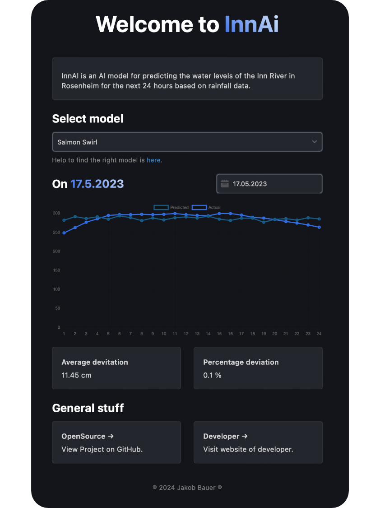
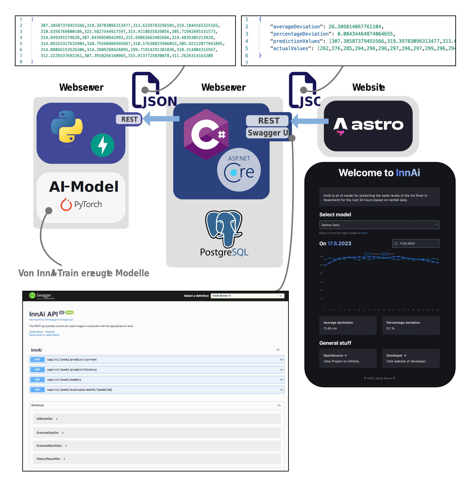
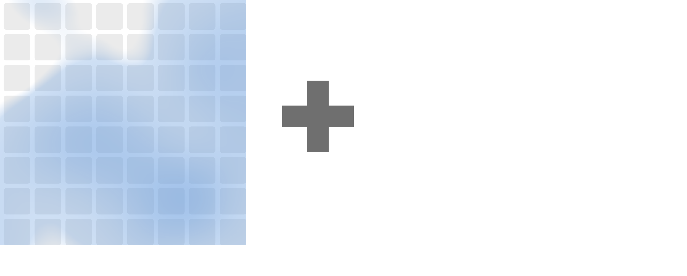
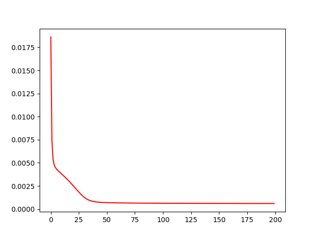
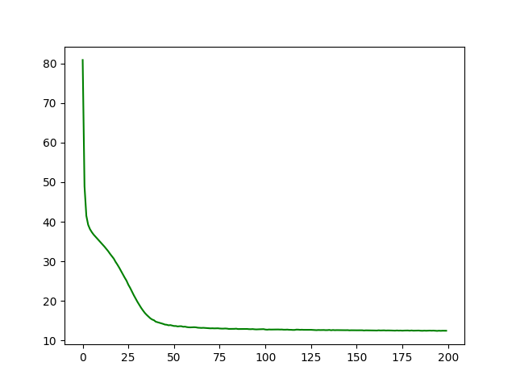
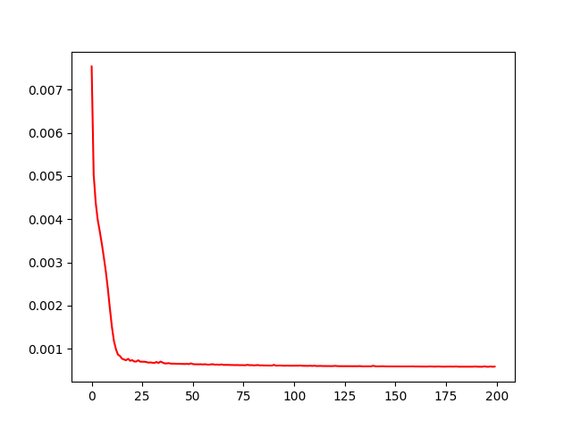
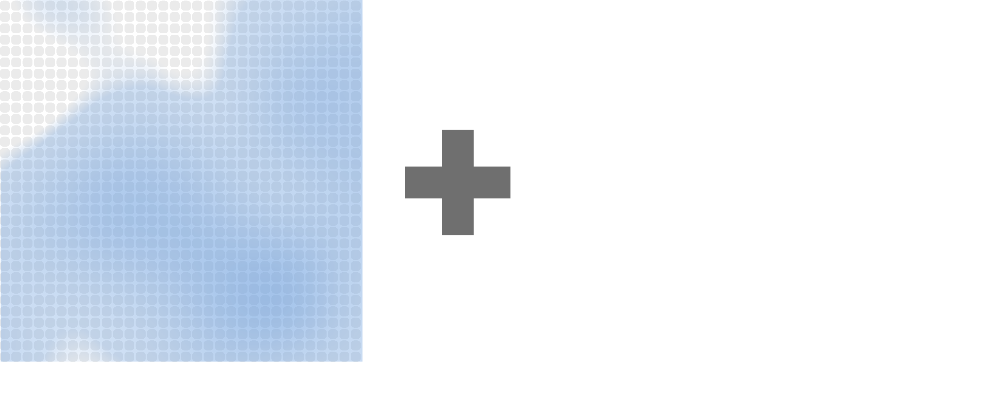
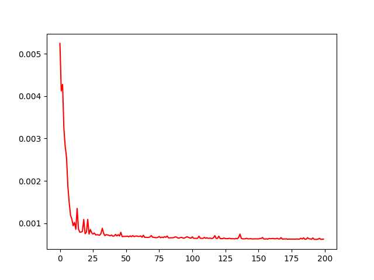

# InnAi Predict 🚀

    

Visit Website of InnAi 👉 <a href="https://innai.de">here</a> 👈

## What is InnAi 🌊
InnAI is an attempt to predict water level values using precipitation data with a neural network.

## All InnAi Projects
<table>
    <tr>
        <th>Model</th>
        <th>Link</th>
        <th>Short description</th>
    </tr>
    <tr>
        <th>InnAi-Predict 🎯</th>
        <td>You are here 👉👈</td>
        <td>Website for displaying and comparing results, with a server featuring a REST interface for data provision.</td>
    </tr>
    <tr>
        <th>InnAi-Train 🏃</th>
        <td><a href="https://github.com/bauerjakob/innai-train">Click here to open</a> 👈</td>
        <td>AI models are trained there, and training data is prepared there.</td>
    </tr>
    <tr>
        <th>InnAi-Production 🔥</th>
        <td><a href="https://github.com/bauerjakob/innai-production">Click here to open</a> 👈</td>
        <td>Deployment of Reverse Proxy and Services.</td>
    </tr>
</table>

## Architecture Overview

    

## InnAi Models

### Salmon Swirl
#### Model Input

    

#### Training Results
<table>
    <tr>
        <th>Loss graph</th>
        <th>Evaluation graph (normalized)</th>
        <th>Evaluation graph (denormalized)</th>
        <th>Average evaluation loss (denormalized)</th>
    </tr>
    <tr>
        <td>
            
        </td>
        <td>
            
        </td>
        <td>
            
        </td>
        <td>
            
11.9380

        </td>
    </tr>
</table>

### Roach River
#### Model Input

    

#### Training Results
<table>
    <tr>
        <th>Loss graph</th>
        <th>Evaluation graph (normalized)</th>
        <th>Evaluation graph (denormalized)</th>
        <th>Average evaluation loss (denormalized)</th>
    </tr>
    <tr>
        <td>
            
        </td>
        <td>
            
        </td>
        <td>
            
        </td>
        <td>
            
12.4296

        </td>
    </tr>
</table>

### Zander Zenith
#### Model Input

    

#### Training Results
<table>
    <tr>
        <th>Loss graph</th>
        <th>Evaluation graph (normalized)</th>
        <th>Evaluation graph (denormalized)</th>
        <th>Average evaluation loss (denormalized)</th>
    </tr>
    <tr>
        <td>
            
        </td>
        <td>
            
        </td>
        <td>
            
        </td>
        <td>
            
12.2053

        </td>
    </tr>
</table>
